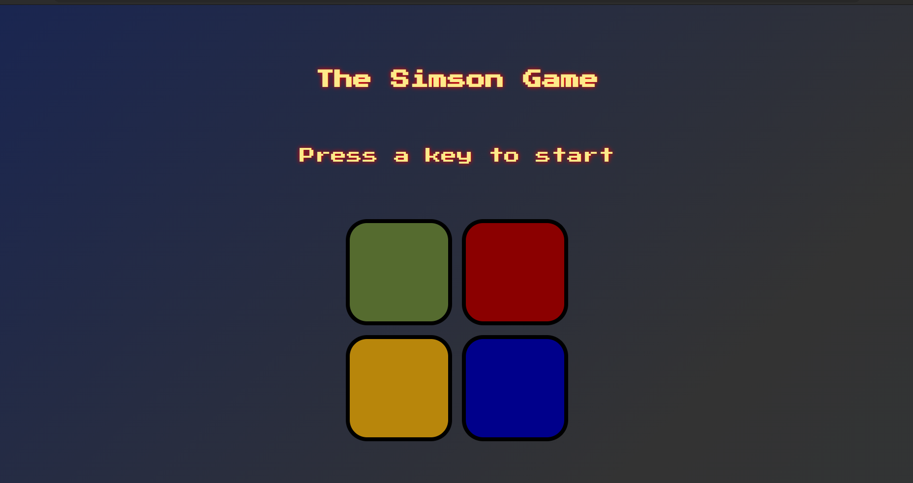

# 🎮 The-simon-game 🎮

The Simon Game is a web-based game built using HTML, CSS, jQuery ,and JavaScript. The game challenges players to repeat a sequence of colors and sounds that are played by the game. The game features animations and sound effects to enhance the user experience. The objective of the game is to repeat the sequence correctly for as many rounds as possible. The game is designed to be easy to play and accessible to users of all skill levels.

## Deployment

Deployed Website: [not deployed yet-- Deploy when repo go public]

## Demo Video

[Demo Video](https://github.com/mtheggi/The-simons-game/assets/88272272/85e530ce-2d87-4eae-b20b-0f3fb1f6b119)

## Built With

- HTML
- CSS
- JavaScript
- jQuery

## Acknowledgments

- The Complete 2021 Web Development Bootcamp by Angela Yu
